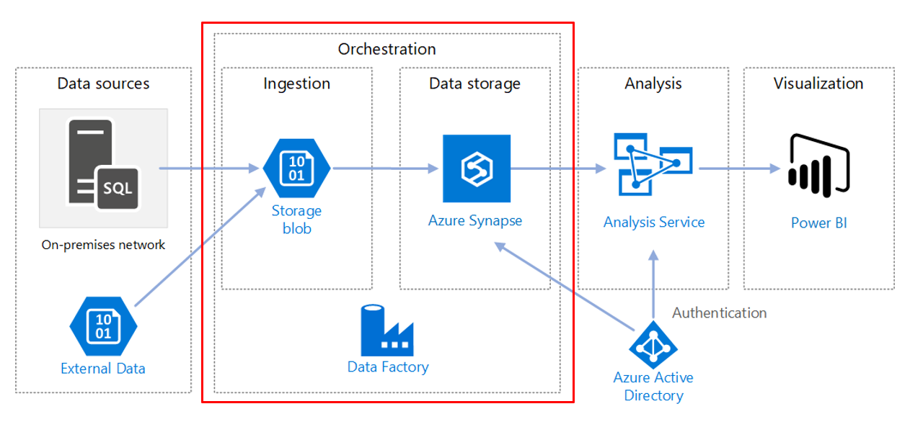

## Enterprise BI example
Reference architecture shows how to perform incremental loading and extract, load, and transform (ELT) pipeline. 
Azure Data Factory automate the ELT pipeline which incrementally moves the latest OLTP data from SQL Server database into Azure Synapse. Transactional data is transformed into a tabular model for analysis.

### Scenario:
In typical enterprise data warehousing usecase some features are important- 
* Automation of the pipeline using Data Factory
* Incremental loading.
* Integrating multiple data sources.
* Loading binary data such as geospatial data and images.



### Apply the landingzone template
```bash
# Set the folder name of this example
example=enterprise-bi

# Deploy networking
rover -lz /tf/caf/landingzones/landingzone_networking/ \
      -tfstate landingzone_networking.tfstate \
      -var-file /tf/caf/examples/${example}/landingzone_networking.tfvars \
      -a apply
	  
# Run data landing zone deployment
rover -lz /tf/caf/ \
      -tfstate ${example}_landingzone_data.tfstate \
      -var-file /tf/caf/examples/${example}/configuration.tfvars \
      -var tfstate_landingzone_networking=${example}_landingzone_networking.tfstate \
      -var landingzone_tag=${example}_landingzone_dap \
      -a apply
	  
```