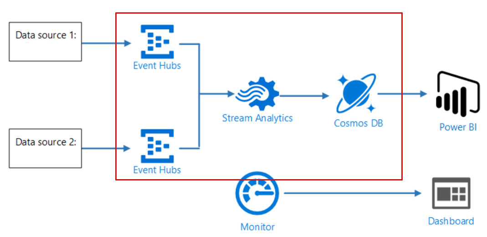

## Stream Analytics example

This reference architecture shows an end-to-end stream processing pipeline. The pipeline ingests data from two sources, correlates records in the two streams, and calculates a rolling average across a time window. The results are stored for further analysis.

### Scenario:
The data sources that generate data streams in real time. Each data source sends a stream of data to the associated event hub.
A Stream Analytics job reads the data streams from the event hubs and performs stream processing.
The output from the Stream Analytics job is a series of records, which are written as JSON documents to a Cosmos DB document database.
Further this can be used for visualization and for ML usec case or other downstream systems. 

