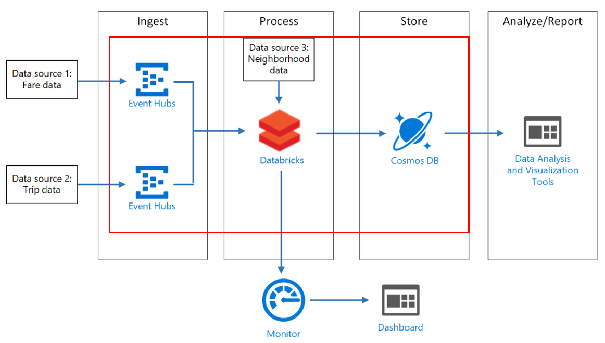

## Databricks Stream Processing example
This reference architecture shows an end-to-end stream processing pipeline using Azure Databricks. This type of pipeline has four stages: ingest, process, store, and analysis and reporting. For this reference architecture, the pipeline ingests data from two sources, performs a join on related records from each stream, enriches the result, and calculates an average in real time. The results are stored for further analysis.



### Apply the landing zone
```bash
# Set the folder name of this example
example=stream-analytics

# Deploy networking
rover -lz /tf/caf/landingzones/landingzone_networking/ \
      -tfstate landingzone_networking.tfstate \
      -var-file /tf/caf/examples/${example}/landingzone_networking.tfvars \
      -a apply
	  
# Run data landing zone deployment
rover -lz /tf/caf/ \
      -tfstate ${example}_landingzone_data.tfstate \
      -var-file /tf/caf/examples/${example}/configuration.tfvars \
      -var tfstate_landingzone_networking=${example}_landingzone_networking.tfstate \
      -var landingzone_tag=${example}_landingzone_dap \
      -a apply
	  
```
